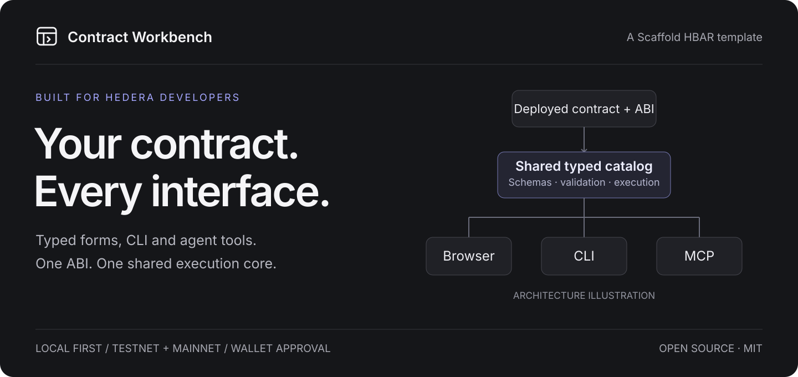
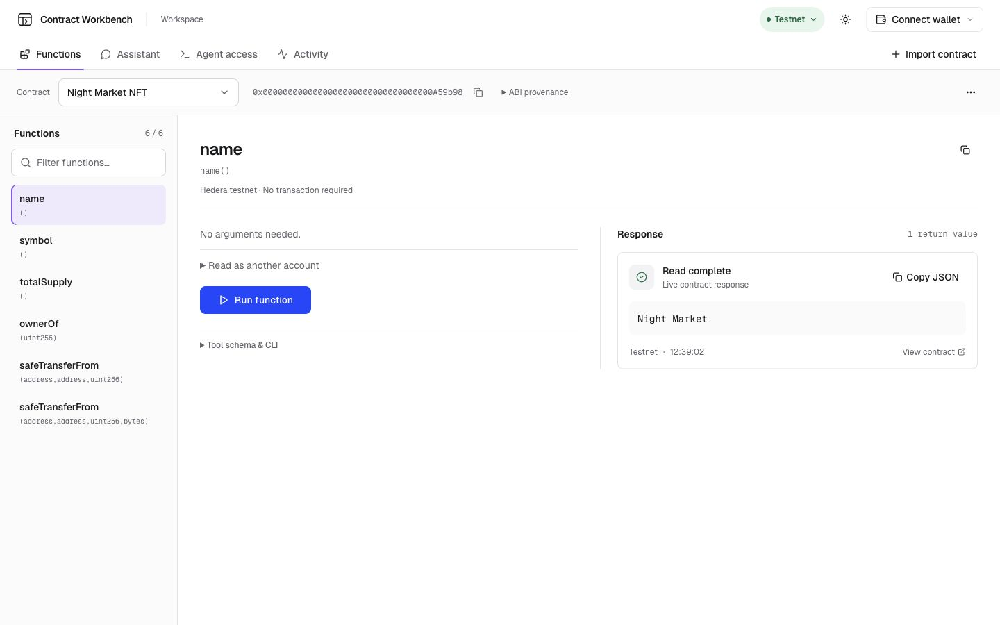
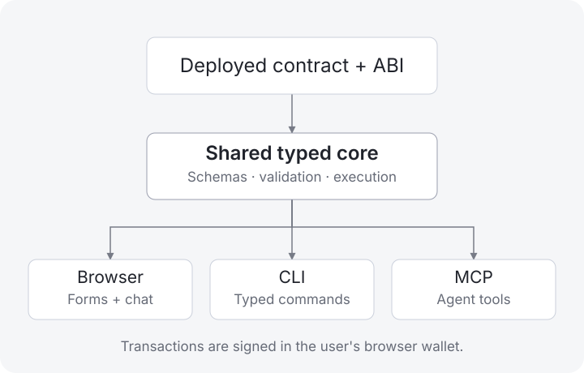

# Contract Workbench

[](https://hedera-contract-workbench.vercel.app)

**Bring a deployed Hedera EVM contract. Get typed forms, CLI commands and agent tools from its ABI.** Contract Workbench is a Scaffold HBAR template for developers exploring or integrating existing contracts. Import once and use the same validated catalog in the browser, terminal, MCP client or optional AI assistant. Your browser wallet reviews and signs transactions.

[**Try the public preview**](https://hedera-contract-workbench.vercel.app) · [**Demo & walkthrough**](https://hedera-contract-workbench.vercel.app/demo) · [**Read the guides**](https://hedera-contract-workbench.vercel.app/docs) · [**Architecture**](docs/ARCHITECTURE.md)

The demo page includes actual product screenshots, a live testnet read and verification links. Its YouTube walkthrough is pending. Add the recording through [`WORKBENCH_DEMO_YOUTUBE_URL`](docs/CONFIGURATION.md#publish-the-demo-video) when ready; a pending video slot is not submission evidence.

The full template runs locally. The public preview offers bundled **reads and unsigned simulation** on testnet and mainnet; contract import, persistent state, optional chat and wallet transactions run in your own workspace. No wallet or API key is needed for your first read.

## Find your way

| What you want to do                                                | Start here                                                                       |
| ------------------------------------------------------------------ | -------------------------------------------------------------------------------- |
| Run the app and read your first function                           | [Quickstart](docs/QUICKSTART.md)                                                 |
| Connect another deployed contract                                  | [Import walkthrough](docs/QUICKSTART.md#bring-another-deployed-contract)         |
| Run typed commands or automate a workflow                          | [CLI and JSON protocol](docs/CLI.md)                                             |
| Give Codex, Claude Code, Cursor or an MCP client the current tools | [Agents and MCP](docs/AGENTS.md) · [project instructions](AGENTS.md)             |
| Configure your wallet, provider or RPC                             | [Configuration and recovery](docs/CONFIGURATION.md)                              |
| Understand supported types, networks and examples                  | [Support and ABI provenance](docs/SUPPORT.md)                                    |
| Review recorded checks and remaining release gates                 | [Delivery record](docs/DELIVERY.md) · [submission readiness](docs/SUBMISSION.md) |

## Run your own workbench

Use **Node 24 LTS**, **npm 10.9.3** and Git. Configure your own Git name and email before using the Scaffold HBAR generator. This command creates a complete project from the public template:

```sh
npx --yes create-scaffold-hbar@0.4.1 my-workbench --template Blockchain-Oracle/hedera-contract-workbench --frontend nextjs-app --solidity-framework hardhat --network testnet --package-manager npm --yes --skip-hedera-skills --skip-install
cd my-workbench
npx --yes npm@10.9.3 ci
npm run dev
```

The generator is pinned to the version we verified. `--skip-hedera-skills` skips its separate marketplace installation; this template already includes its own portable contract skill. `--skip-install` lets you use ordinary pinned npm dependency resolution. The generator currently rewrites package-manager metadata to npm 10.0.0; the tested installation above uses 10.9.3.

Prefer to clone the source directly?

```sh
git clone https://github.com/Blockchain-Oracle/hedera-contract-workbench.git
cd hedera-contract-workbench
npx --yes npm@10.9.3 ci
npm run dev
```

Open **http://127.0.0.1:3000**, choose **Try the testnet example**, select **factory()** and choose **Run function**. You should see an address returned by the actual testnet router. No contract deployment or environment file is required. If an endpoint is unavailable, run `npm run --silent workbench -- doctor --json` and follow its recovery message.



## Bring your contract

Choose **Import contract** in your local app, select its deployment network, then enter its EVM address or Hedera contract ID. The importer tries verified ABI discovery through Sourcify. If discovery cannot supply an ABI, upload an ABI array or a Solidity artifact containing `abi`. Imports persist locally and survive restart.

Importing connects an existing deployment; it does not deploy source or move a contract between networks. A governance, NFT or DeFi ABI uses the same engine and interface. Its own functions replace the selected catalog; there is no contract categorization or permanent Swap screen.

Required arguments are validated before RPC. **Find a value** can read a compatible getter from that contract and let you apply an actual result. Check its meaning and units: a count does not enumerate valid IDs, and an address type does not identify an intended recipient. When no suitable getter exists, supply the value from an authoritative source. [Supported types and limits](docs/SUPPORT.md).

## Use the terminal

The CLI builds its runtime on first use. Human mode offers readable summaries; `--json` never prompts and emits one versioned envelope. These commands run the bundled testnet example:

```sh
npm run --silent workbench -- contracts list --json
npm run --silent workbench -- tools list --contract saucerswap-testnet --json
npm run --silent workbench -- tools inspect read_factory_c5d171ab56a811f2 --json
printf '{}' | npm run --silent workbench -- tools call read_factory_c5d171ab56a811f2 --args-file - --json
```

For other contracts, discover their actual tool IDs and inspect the current schema before calling. Full signatures distinguish overloads. All ABI integers are **decimal strings** in JSON; native `--value-hbar` is separate from arguments and accepts up to eight fractional digits. [Complete command reference](docs/CLI.md).

## Connect an agent

Install the included portable skill with the official Vercel skills CLI. Run this in the project where your agent will use it:

```sh
npx --yes skills@1.7.0 add Blockchain-Oracle/hedera-contract-workbench --skill hedera-contract-workbench --agent codex claude-code cursor --copy --yes
```

For a local checkout, replace the GitHub source with `./skills/hedera-contract-workbench`. Open **Agent access** to read or download the Markdown, inspect typed argument examples and copy current commands. The skill always follows **discover → inspect → construct arguments → read or prepare → report or open wallet review**. A different contract changes the catalog, not the skill.

```sh
npm run --silent workbench -- skills show --contract saucerswap-testnet --json
npm run --silent workbench -- mcp config --json
```

Copy the generated MCP host configuration into your client; it uses a dedicated stdio server with protocol-only stdout. CLI and MCP need no model key. [Agent installation, exports and host setup](docs/AGENTS.md).

## Review and sign a transaction

Use an injected EVM wallet, such as MetaMask, on **Hedera testnet (296)** or **mainnet (295)**. Testnet is the default. Ordinary reads omit a caller and work without a wallet; choose an explicit caller only for caller-scoped state.

Connecting MetaMask does not create a Hedera account. Caller-specific simulation and transactions need an existing account on the selected network, funding and any contract-specific prerequisites. [Wallet setup and sender errors](docs/CONFIGURATION.md#connect-a-wallet).

CLI, MCP and assistant writes return an **unsigned plan** and a wallet-review URL. Keep the local app running, open that URL and review the chain, account, function, arguments and native value. Core recomputes and simulates the exact transaction before wallet approval. Plans expire after five minutes; account, network or input changes require renewed review.

The returned hash is saved immediately for receipt recovery. Pending confirmation and mirror indexing lag are different states; neither triggers automatic resubmission. [Transaction recovery](docs/CONFIGURATION.md#recover-from-errors).

## Optional assistant

Configure **OpenAI, Anthropic or Gemini** with an explicit compatible model ID in ignored `packages/nextjs/.env.local`. The assistant is scoped to the selected contract and calls the same validated core tools. It displays fixed result, simulation and transaction cards; model-generated code never becomes executable UI. Provider failure leaves deterministic functions available. [Provider configuration](docs/CONFIGURATION.md#enable-the-assistant).

## How the parts connect

[](docs/ARCHITECTURE.md)

ABI normalization and schema generation are deterministic. Core owns validation, network context, unit conversion, RPC execution, registry revisions and transaction-plan integrity. Browser, CLI, MCP and assistant adapters all use that dispatcher. Signing stays in the browser wallet.

Hedera JSON-RPC and matching-network mirror metadata provide execution and identity resolution. Sourcify provides verified ABI discovery when available. SaucerSwap V1 supplies useful deployed examples on both networks and an optional core protocol adapter; it does not add swap behavior to unrelated contracts. [Integration details and ABI sources](docs/SUPPORT.md).

| Path                                                                 | Responsibility                                                                        |
| -------------------------------------------------------------------- | ------------------------------------------------------------------------------------- |
| [packages/core](packages/core)                                       | ABI trees, schemas, registry, reads, simulation, unsigned plans and protocol adapters |
| [packages/cli](packages/cli)                                         | Guided commands, machine output and agent handoff                                     |
| [packages/mcp](packages/mcp)                                         | Dynamic tools and local stdio transport                                               |
| [packages/nextjs](packages/nextjs)                                   | Forms, optional chat, wallet review, documentation and demo                           |
| [packages/hardhat](packages/hardhat)                                 | Original Solidity example and optional maintainer tasks                               |
| [skills/hedera-contract-workbench](skills/hedera-contract-workbench) | Portable skill and argument/protocol references                                       |

## Develop and verify

```sh
npm run lint
npm run typecheck
npm test
npm run build
npm run verify:local
npm run verify:hosting
```

Builds use a pinned local Solidity compiler and require no wallet, RPC access or provider credentials. `verify:local` exercises actual CLI subprocesses and MCP equivalence against an isolated EVM; it does not submit a Hedera transaction. [Contributor and AI instructions](AGENTS.md) · [Architecture](docs/ARCHITECTURE.md) · [Optional hosting](docs/HOSTING.md).

## Availability and evidence

This is a **source preview** with fresh public-scaffold installation, build and boot evidence; typed ABI and CLI/MCP checks; real testnet/mainnet reads; live OpenAI inference; and desktop/phone inspection. A human-controlled funded Hedera transaction, complete wallet acceptance and the current video remain outstanding. An interactive `/demo` is not the required video or transaction evidence.

[Public scaffold checks](docs/evidence/public-scaffold.json) · [Hosted preview checks](docs/evidence/public-preview/checks.json) · [Full delivery record](docs/DELIVERY.md) · [Release checklist](docs/SUBMISSION.md).

Voice, remote MCP, hosted multi-user persistence, arbitrary source deployment and event indexing are outside this release. Mainnet transactions are supported locally, with explicit wallet approval; no automated real-fund acceptance is claimed.

Maintained by **Abubakr Jimoh**. [MIT licensed](LICENSE); [third-party notices](NOTICE.md) identify assets with separate terms.
