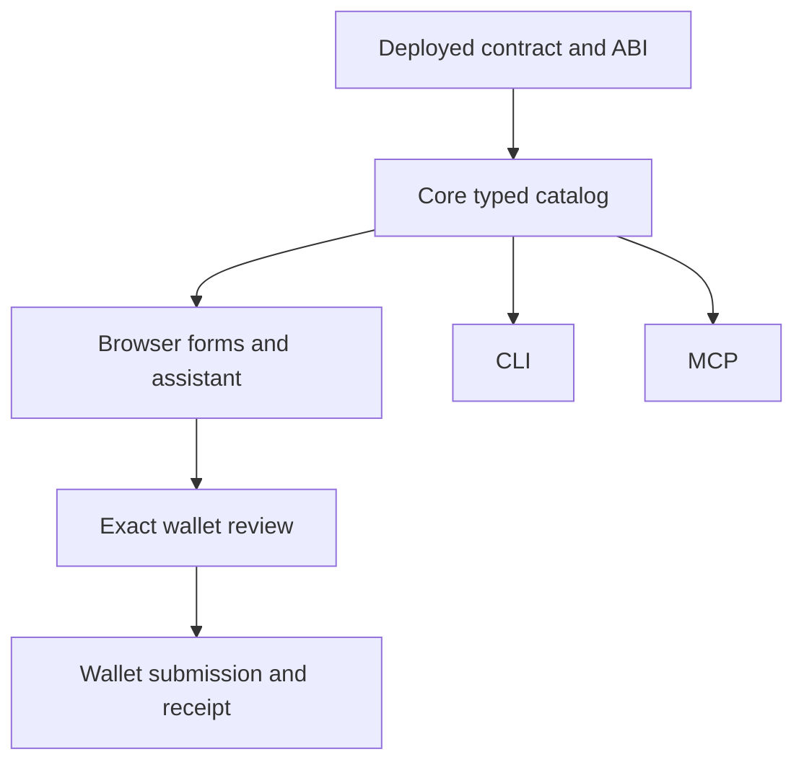

# Architecture

Five npm workspaces: core, CLI, MCP, Next.js, Hardhat. Core depends on viem, abitype, Zod and Node adapters; it has no React, terminal, provider or MCP dependency. Interface adapters use the same dispatcher. ABI generation is deterministic and never calls a model or rewrites application source.

The core catalog binds network, actual resolved address, provenance, ABI hash/revision, full signature, supported action, positional parameter tree and schemas. Integers are strings at JSON boundaries and BigInt internally. Viem owns ABI encoding/decoding and RPC. Tuples decode positionally before stable field names are restored, avoiding loss from duplicate labels.

Committed defaults live in core/bundled.ts plus workbench.config.json. Imports/tombstones are merged from ignored workbench.config.local.json. Exclusive locks serialize edits; atomic temporary-file rename protects the registry. Refresh checks the expected prior revision. Cached type trees are bounded; identical concurrent reads deduplicate; RPC work uses a semaphore and request timeout. Browser and assistant cancellation flows through AbortSignal to viem HTTP; MCP request cancellation also reaches the dispatcher. Independently cancellable reads use separate requests so cancelling one cannot abort another subscriber; ordinary identical concurrent reads deduplicate.

Transactions are unsigned five-minute plans binding chain, network, sender, recipient, full function signature, arguments, calldata, value, interface revision and expiry. The browser asks core to recompute and simulate, then requests wallet approval for those exact fields. Changes invalidate the review. Digests provide integrity consistency, not an authorization signature; the visible review and wallet are the authorization boundary.

Hashes are written immediately to browser recovery and local server journals. Receipt recovery checks matching from/to/calldata/value when a journal binds a plan. Mirror indexing is distinct from RPC confirmation. No uncertain transaction is automatically resubmitted.

The optional assistant has only selected-contract tools. It can inspect/discover, perform reads and prepare writes under bounded execution. Its tool schemas come from core. It renders predefined components for real results/plans/errors; tool metadata cannot inject executable UI. Provider keys stay on the server.

Build order is shared libraries → adapters → locally pinned Solidity compiler → Next.js. Build must require no provider secret, wallet, deployment or network access. Dev builds first, reports readiness, runs library watchers and Next, then terminates child processes on shutdown.
