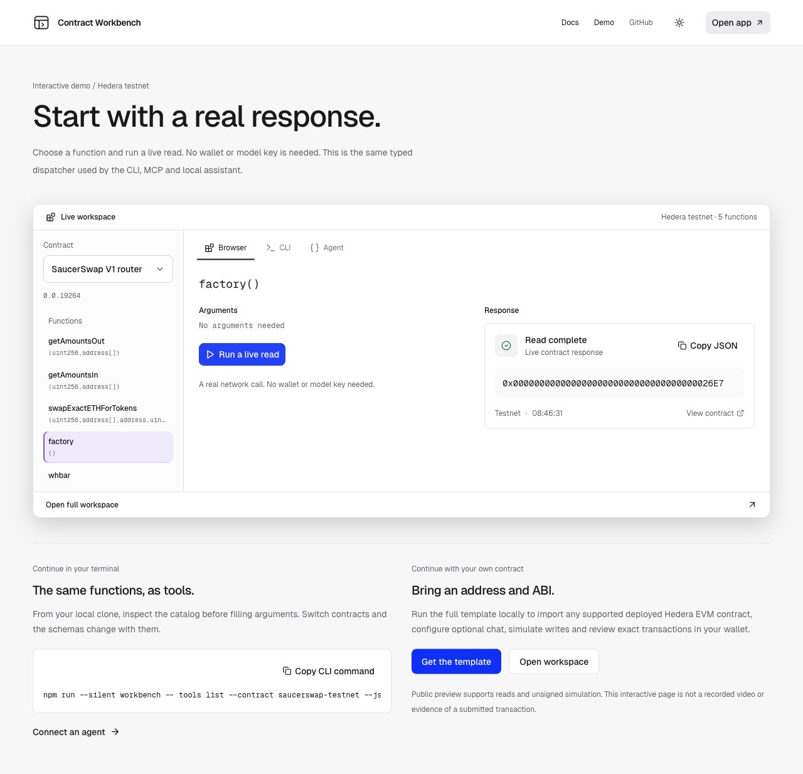

# Run your own workbench

The public preview offers real bundled contract reads and unsigned simulation. Your local template includes contract import, persistent catalogs, CLI, MCP, a portable agent skill, optional AI chat and browser wallet transactions on testnet and mainnet.

## Install and launch

Use Node 24 LTS and npm 10.9.3. No wallet, private key or model key is needed to start.

```sh
git clone https://github.com/Blockchain-Oracle/hedera-contract-workbench.git
cd hedera-contract-workbench
npx --yes npm@10.9.3 ci
npm run dev
```

Open `http://127.0.0.1:3000`.

1. Choose **Try the testnet example** on the home page.
2. Check the contract toolbar shows **Testnet** and **SaucerSwap V1 router**. The contract picker switches the selected deployment; it does not change a contract's chain.
3. Select **factory()** and choose **Run function**. This getter takes no arguments. The result is the factory address returned by Hedera JSON-RPC, with its execution context.



The [public demo](https://hedera-contract-workbench.vercel.app/demo) lets you try this read before installing. A public endpoint can be temporarily unavailable; `npm run --silent workbench -- doctor --json` checks your local configuration and network.

Try the same bundled read in your terminal:

```sh
npm run --silent workbench -- tools list --contract saucerswap-testnet --json
npm run --silent workbench -- tools inspect read_factory_c5d171ab56a811f2 --json
printf '{}' | npm run --silent workbench -- tools call read_factory_c5d171ab56a811f2 --args-file - --json
```

The example tool ID belongs to the bundled testnet `factory()`. For another function or ABI revision, use the ID returned by its current catalog.

## Use the official Scaffold HBAR generator

Configure your own Git name and email first. The generator checks Git identity even when installation is skipped.

```sh
npx --yes create-scaffold-hbar@0.4.1 my-workbench --template Blockchain-Oracle/hedera-contract-workbench --frontend nextjs-app --solidity-framework hardhat --network testnet --package-manager npm --yes --skip-hedera-skills --skip-install
cd my-workbench
npx --yes npm@10.9.3 ci
npm run dev
```

The generator currently rewrites package-manager metadata to npm 10.0.0. Our compatibility verification uses ordinary npm 10.9.3 installation; it does not rely on `--legacy-peer-deps`. The five workspaces and workbench commands survive generation.

## Bring another deployed contract

1. In your local app, choose **Import contract**.
2. Select the actual deployment network and enter its EVM address or Hedera contract ID. Import does not deploy anything or copy a contract to another chain.
3. Let verified ABI discovery run. If it cannot find an ABI, upload an ABI array or a Solidity artifact JSON containing `abi`.
4. Inspect the imported contract's address, provenance and functions. Select a function and provide its required arguments; invalid fields show inline feedback before RPC.
5. Run a read, or simulate/prepare a write with the intended caller. Restart the app to reuse the persisted catalog.

Function forms, tools and skills come from the same ABI; the template does not classify contracts into token, NFT or DAO categories. Local imports are stored in ignored `workbench.config.local.json`; they are not uploaded to the public preview.

The CLI can import a supplied ABI too. This executable example connects the existing testnet router using the committed interface subset:

```sh
npm run --silent workbench -- contracts import --network testnet --address 0.0.19264 --abi docs/examples/router.abi.json --name 'My router' --json
npm run --silent workbench -- contracts list --json
```

All ABI integers use decimal strings in JSON, including token IDs. Inspect the current schema before constructing arguments. Getter suggestions help discover existing values but do not invent IDs or recipients.

## Use the terminal or your agent

```sh
npm run --silent workbench -- contracts list --json
npm run --silent workbench -- tools list --contract saucerswap-testnet --json
npm run --silent workbench -- skills show --contract saucerswap-testnet --json
npm run --silent workbench -- mcp config --json
```

Open **Agent access** in the local app for current commands, argument templates, Markdown and host setup. The portable skill works across imported ABIs by inspecting the current catalog. See [CLI commands](CLI.md) and [agent setup](AGENTS.md).

## Wallets and optional chat

Ordinary reads omit the connected wallet as caller. Caller-specific reads and simulation require an existing account on the selected network. Connecting MetaMask alone does not create that Hedera account.

For transactions, keep the local app running, open the returned wallet-review URL, check its network/account/function/arguments/value and approve the exact transaction in your browser wallet. Account or input changes require renewed review. CLI, MCP and chat never sign. If a hash was returned, check that hash's receipt instead of sending again. [Wallet setup and recovery](CONFIGURATION.md#connect-a-wallet).

Chat uses your server-side OpenAI, Anthropic or Gemini configuration with an explicit model ID. Keys belong in ignored local configuration. See [configuration](CONFIGURATION.md). Missing keys leave deterministic functions available.

## Current release status

This is a source preview with installation and execution evidence, not a claim of completed bounty acceptance. Funded Hedera testnet wallet acceptance and a current video demo remain outstanding. See [submission readiness](SUBMISSION.md) and [verification tracker](DELIVERY.md).
